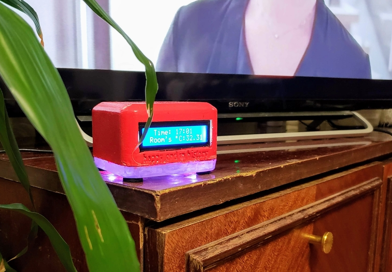
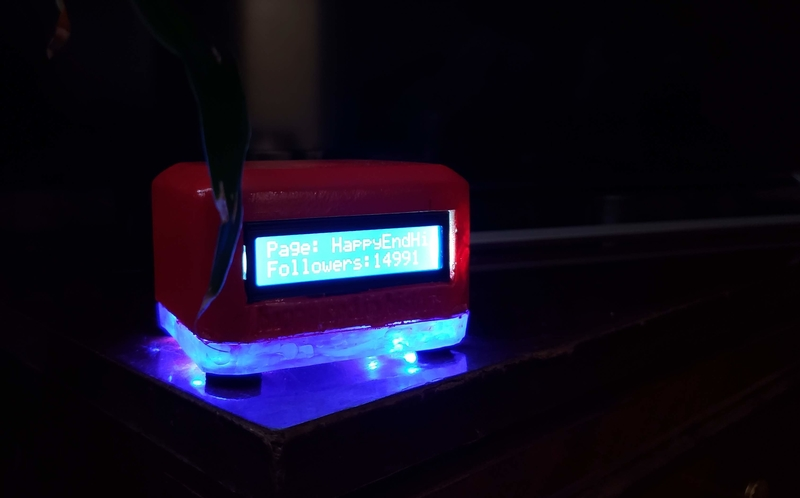
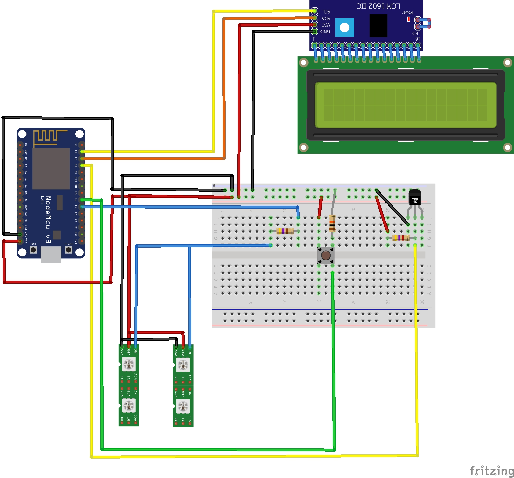
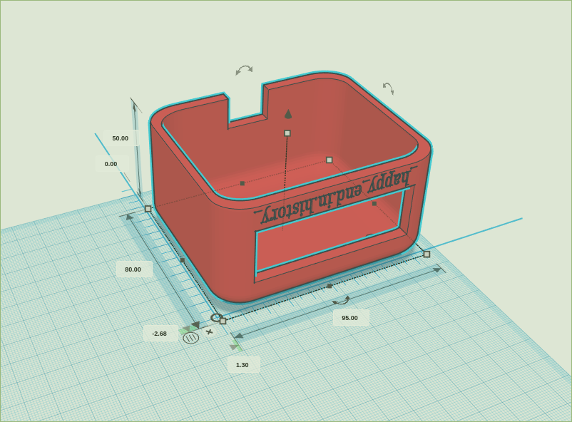

# Счетчик Подписчиков Instagram nodemcu (Russian readme)

"Счетчик Подписчиков Instagram" это небольшой контейнер для платы nodemcu v3, экрана, датчика температы и диодной лентой. 
Этот маленький проект создавался как подарок для моей младшей сестры, которая увлекается ведением групп в истаграмме.
Проект вдохновлен творчеством [ Alex Gayver'а](https://github.com/AlexGyver) и частично использует код проекта[Youtube widget](https://github.com/AlexGyver/YouTube_widget).

### Возможности

 * Вывод на экран кол-во подписчиков пользователя истаграмм;
 * Вывод на экран прироста подписчиков в час и  в день;
 * Вывод на экран информацию о последней посте;
 * Вывод на экран времени и температуры в комнате;
 * Переключению между экранами по нажатию на кнопку;
 * Изменение цвета диодной ленты в зависимости от кол-ва подписчиков (синий -> зеленый -> красный).

 

# Сборка 

Схема сборки на отладочной плате выглядит следующим образом:

## Таблица необходимых компонентов

Количество | Тип Детали | Описание
------------| -------------|-------
1|LCD экран|type Character; pins 16
1|LCM1602 IIC|chip label LCM1602 IIC; pins 22; package DIP (Dual Inline) [THT]; variant variant 2; editable pin labels false; part # LCM1602 IIC
1|470Ω резистор|package THT; resistance 470Ω; bands 4; tolerance ±10%; pin spacing 400 mil
1|4.7kΩ резистор|package THT; resistance 4.7kΩ; bands 4; tolerance ±5%; pin spacing 400 mil
1|10kΩ резистор|package THT; resistance 10kΩ; bands 4; tolerance ±5%; pin spacing 400 mil
4|SMD RGB LED (WS2812)|package 5050; variant WS2812
1|Кнопка|package ksa_sealed_tac_switch; variant ksa_sealed
1|DS18S20 Датчик температуры|type solid state; package TO92 [THT]; variant DS18S20
1|NodeMCU V3.0|chip ESP8266;     

Питание подается по micro-usb кабелю.

## Печать 3d компонентов

Для разработки контейнера, в который будут помещены электронные компоненты была использована онлайн 3d редактор [tinkercad](www.tinkercad.com). Сам контейнер состоит из двух частей верхнего кожуха из пластика(лучше использовать PLA\ABS пластики так как особых требований к прочности детали нет) длина - 95 мм; ширина - 80 мм; высота - 50 мм;  и нижней плиты из огрстекла(для LED подсветки) длина - 95 мм; ширина - 80 мм; высота - 10 мм;.

    
Для сборки всех компонентов были использованы жидкие сопли, aka клеевой пистолет :) 

# Программная часть

Програмно "Счетчик Подписчиков Instagram" разделен на два компонента:
* Proxy запросов к Instagram Api,в ввиде сниппета на php
* Скетч с прошивкой для nodemcu v3

Необходимость в Proxy возникла из-за того, что чип esp8266 имеет плохую документацию к API для работы c ssl сертификатами и https запросами, что не позволило быстро написать методы доступа к API instagram по протоколу https. Использования php сниппета также позволяет решить проблему с реальным временем отображаемым на одном из экранов устройства. 

UDP:Теоретически всю логику подсчета подписчиков можно перенести в php, оставив nodemcu только опращивать датчики и менять текст экранов. 

# Развертывание 

Для корректной работы устройства необходимо:

 1. Получить [accessToken instagram api](https://elfsight.com/blog/2016/05/how-to-get-instagram-access-token/);
 2. В  `instagramProxySnippet.php`  заменить `<INSERT THERE YOUR ACCESS TOKEN>` на полученный токен и заделпоить его на любом php хостинге.
 3. В `nodemcu_instagram_follower_counter.ino` заменить следующие значения:
    1. `<SSID>` на имя сети;
    2. `<PASS>` на пароль сети;
    3.  `<INSERT URL HERE>` на url по которому доступен `instagramProxySnippet.php`

# Follower Counter for Instagram  nodemcu (English readme)
 
Amount | Part Type | Properties
------------| -------------|-------
1|LCD screen|type Character; pins 16
1|LCM1602 IIC|chip label LCM1602 IIC; pins 22; package DIP (Dual Inline) [THT]; variant variant 2; editable pin labels false; part # LCM1602 IIC
1|470Ω Resistor|package THT; resistance 470Ω; bands 4; tolerance ±10%; pin spacing 400 mil
1|4.7kΩ Resistor|package THT; resistance 4.7kΩ; bands 4; tolerance ±5%; pin spacing 400 mil
1|10kΩ Resistor|package THT; resistance 10kΩ; bands 4; tolerance ±5%; pin spacing 400 mil
4|SMD RGB LED (WS2812)|package 5050; variant WS2812
1|Momentary Switch|package ksa_sealed_tac_switch; variant ksa_sealed
1|DS18S20 Temperature Sensor|type solid state; package TO92 [THT]; variant DS18S20
1|NodeMCU V3.0|chip ESP8266;     